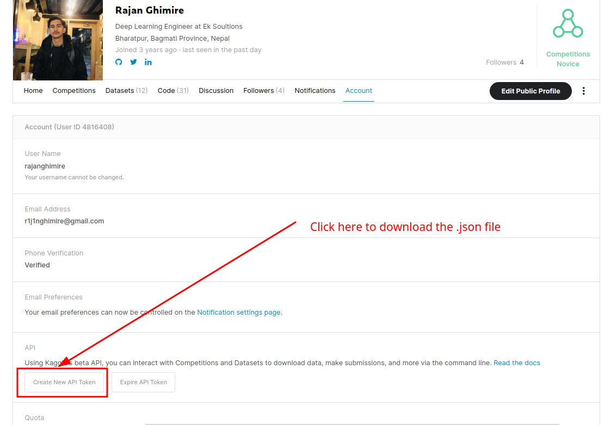

## Vector Quantized Variational Autoencoders (VQ-VAE)
* * * 
Implemenation of Vector Quantized Variational Autoencoders from scratch in python.


Step 1: 
* * * 
Setup environment:<br>
```
conda env create -f environment.yml
```
Step 2: 
* * * 
Download dataset:<br>
To download the dataset, at first, download the ```kaggle.json``` file from your kaggle profile and put it in the project directory.
Navigate to your kaggle profile and download the .json file as shown below.<br>
<p align="center" >

</p>

Now, run the following to download the celeba dataset. 
```
python download_data.py

```

Step 3: 
* * * 
To train the model run:
```
python train.py
``` 
All the plots and model will be saved in the ```results``` directory.